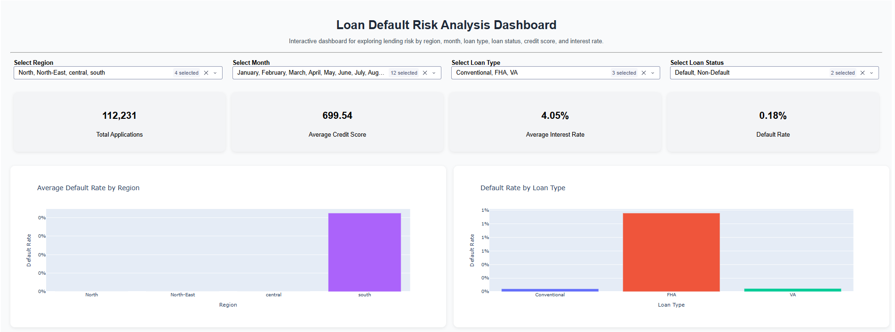
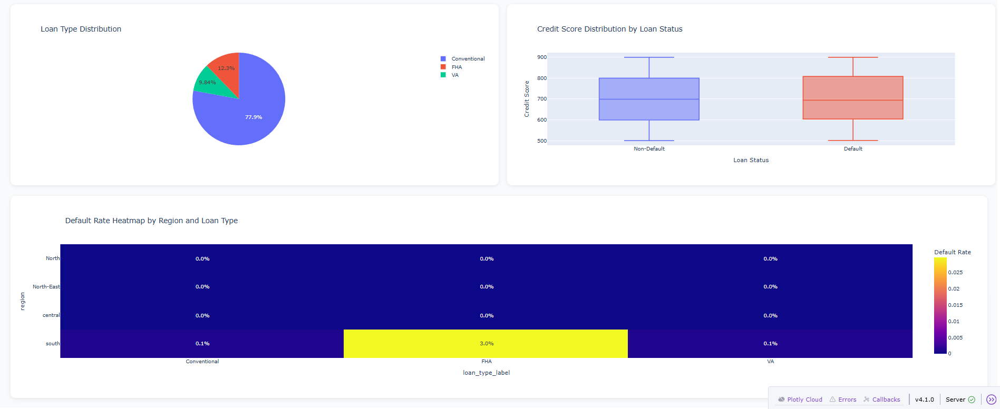
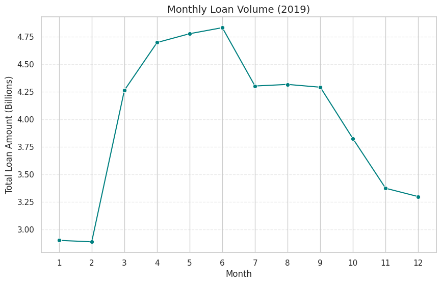

# Loan Default Risk Analysis Dashboard

## Team Collaboration

This project was completed as part of a group assignment through the NPower Canada Data Analytics program.

### Team Contributions
- Dataset selection and initial project direction: Medhanit and Edwin
- Exploratory analysis and insight discovery in Google Colab: Nuha and Divya
- Initial Dash dashboard implementation in Visual Studio Code: Froila

### My Contributions
I helped guide the overall project direction and supported the team in defining meaningful business questions and identifying financial insights to explore within the dataset.

My direct contributions included:

- Oversaw project coordination and alignment across deliverables
- Helped shape the analytical approach and identify target insights during early exploration
- Refined and enhanced the Dash dashboard in Visual Studio Code
- Improved dashboard usability by adding additional filters and replacing the year selector with monthly analysis
- Created the final PowerPoint presentation and presentation narrative
- Converted the presentation to PDF and published it to the repository for public access
- Added markdown structure and documentation in the Colab notebook to improve readability and storytelling
- Supported GitHub documentation and final project packaging
- Designed and built a polished project landing page (index.html) using HTML, CSS, and JavaScript — featuring an interactive hero section, KPI cards, visualization gallery, insights, and strategic recommendations
- Deployed the landing page as a live public website via GitHub Pages

## Project Overview

This project analyzes loan default data to identify borrower risk patterns, financial trends, and lending insights using Python, data visualization, and interactive dashboard development.

The analysis includes:

- Data cleaning and preprocessing
- Exploratory Data Analysis (EDA)
- Statistical analysis
- Financial trend analysis
- Interactive dashboard development with Dash and Plotly
- Loan default risk exploration

---

# Technologies Used

- Python
- Pandas
- NumPy
- Matplotlib
- Seaborn
- Plotly
- Dash
- Scikit-learn
- Jupyter Notebook
- Visual Studio Code

---

# Interactive Dashboard

The project includes an interactive dashboard built with Dash and Plotly for dynamic loan risk exploration.

Dashboard features include:

- Region filtering
- Month filtering
- Loan type filtering
- Loan status filtering
- KPI summary cards
- Interactive charts and heatmaps

---

# Dashboard Screenshots

## Main Dashboard Overview

---

## Additional Dashboard Visualizations

---

# Exploratory Data Analysis Visualizations

## Average Default Rate by Region

---

## Distribution of Loan Types

---

## Default Rate by Loan Purpose

---

## Loan Defaults by Loan Purpose

---

## Loan Purpose to Debt to Income Ratio

---

## Loan Status Proportion by Type

---

## Monthly Loan Volume (2019)

---

## Pre-Approval Distribution by Loan Type

---

## Property Value vs Loan Amount

---

## Relationship Between Borrower Income and Loan Amount

---

## Relationship Between Loan Amount and Interest Rate Spread

---

## Relationship Between Property Value and Interest Rate Spread

---

## Impact of Credit Score on Loan Amount and Default Risk

---

## Detected Outliers by Financial Feature

---

# Project Files

- `app.py` → Interactive dashboard application
- `loan_default_risk_analysis.ipynb` → Jupyter Notebook analysis
- `Loan Default Risk Analysis Presentation.pdf` → Final presentation
- `README.md` → Project documentation

---

# Key Insights

- FHA loans showed higher default rates than Conventional and VA loans.
- Education and Home Improvement loans had elevated default counts.
- Borrower income generally correlated with higher loan amounts.
- Interest rate spread showed negative relationships with property value and loan amount.
- Certain regions demonstrated higher average default rates.
- Outlier analysis identified extreme values in property value and loan amount variables.

---

# Future Improvements

Potential future enhancements include:

- Predictive machine learning models
- Real-time deployment
- Additional financial indicators
- Enhanced filtering and interactivity
- Cloud deployment for public access

---

# Author

Diane King  
UX Designer | Data Analytics | AI & Visualization
