# Loan Default Risk Analysis Dashboard

## Project Overview

This project focuses on analyzing loan default data to identify patterns, trends, and potential financial risk indicators within a lending portfolio.

Using Python and data analytics techniques, the dataset was cleaned, transformed, and explored through statistical analysis and visualization. The project aims to better understand borrower behavior and factors that may contribute to loan default risk.

The analysis includes:

- Data cleaning and preparation
- Exploratory Data Analysis (EDA)
- Statistical analysis
- Data visualization
- Predictive modeling
- Interactive dashboard development

Key areas explored throughout the project include:

- Regional loan default patterns
- Credit score distribution
- Loan amount trends
- Borrower financial indicators
- Relationships between lending variables and default risk

Several visualizations and machine learning models were developed to support business intelligence insights and demonstrate how data analytics can assist financial institutions in making more informed lending decisions.

The final stage of the project includes an interactive dashboard built with Dash and Plotly to allow dynamic exploration of loan default trends and borrower risk factors.

---

# Technologies Used

- Python
- Pandas
- NumPy
- Matplotlib
- Seaborn
- Plotly
- Dash
- Scikit-learn
- Jupyter Notebook
- Visual Studio Code

---

# Interactive Dashboard

## Main Dashboard Overview

---

## Additional Dashboard Visualizations

---

# Exploratory Data Analysis Visualizations

## Monthly Loan Volume Trend

---

## Default Rate by Loan Purpose

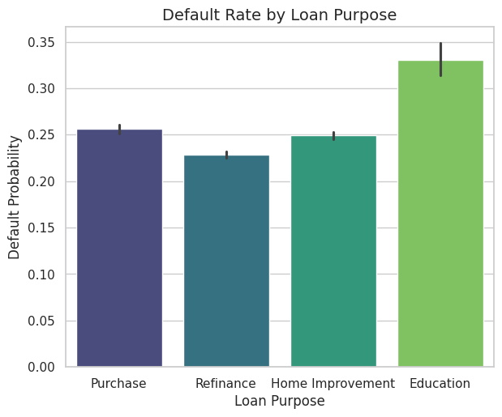

---

## Detected Outliers by Financial Feature

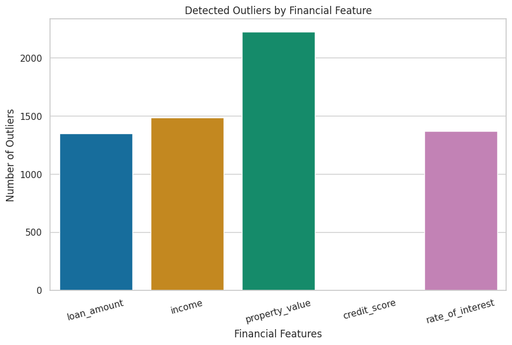

---

## Distribution of Loan Types

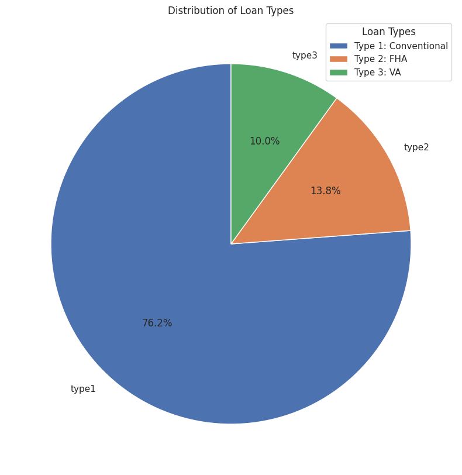

---

## Credit Score and Default Risk

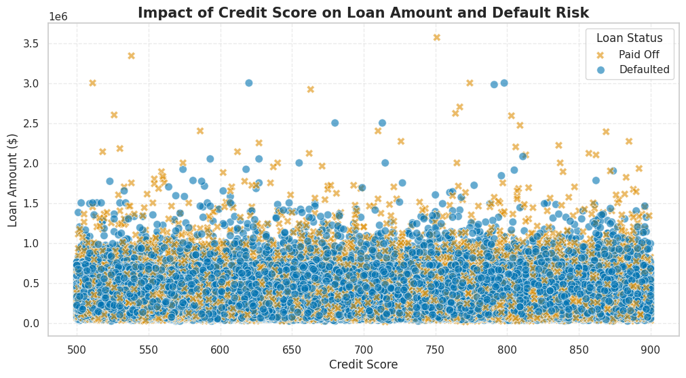

---

## Loan Defaults by Loan Purpose

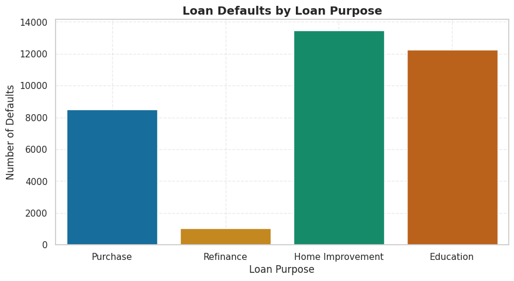

---

## Loan Purpose to Debt to Income Ratio

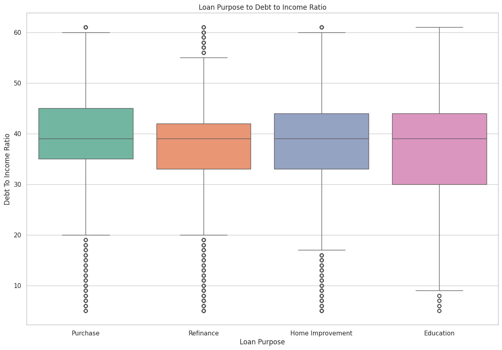

---

## Loan Status Proportion by Type

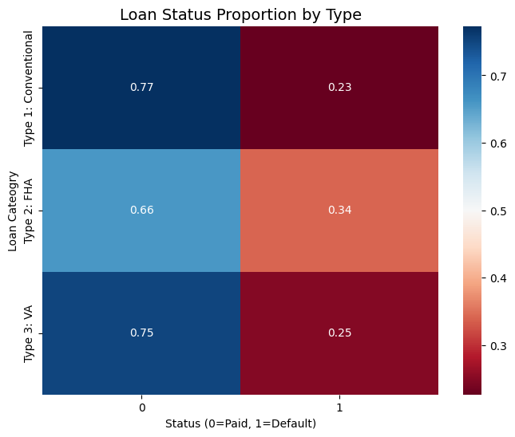

---

## Pre-Approval Distribution by Loan Type

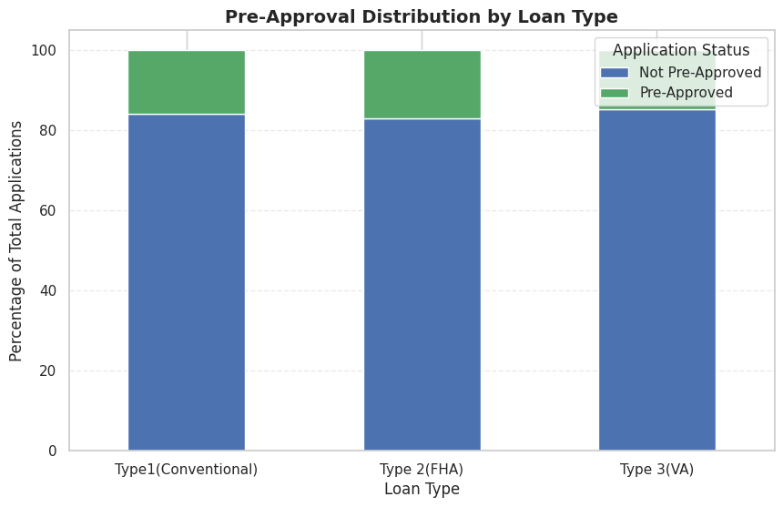

---

## Property Value vs Loan Amount

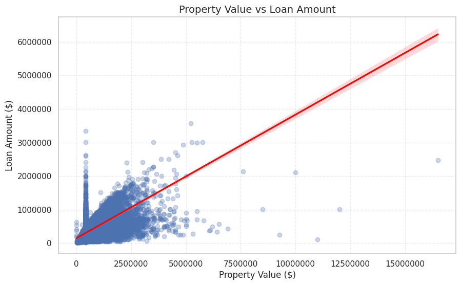

---

## Relationship Between Borrower Income and Loan Amount

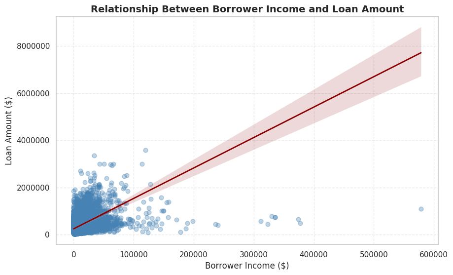

---

## Relationship Between Loan Amount and Interest Rate Spread

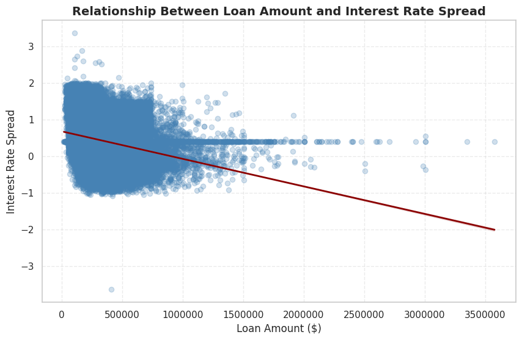

---

## Relationship Between Property Value and Interest Rate Spread

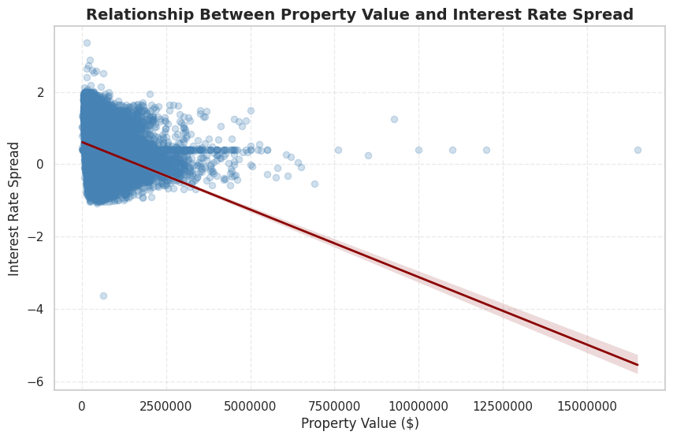

---

# Project Files

- `app.py` → Dash interactive dashboard application
- `Data_Analytics_Project_Activity.ipynb` → Google Colab / Jupyter Notebook analysis
- `Loan_Default.csv` → Dataset used for analysis
- `requirements.txt` → Python dependencies
- `Loan Default Risk Analysis Presentation.pdf` → Final presentation deck

---

# Dashboard Features

The interactive dashboard includes:

- Multi-select dropdown filters
- Real-time KPI updates
- Interactive Plotly visualizations
- Heatmaps
- Loan risk trend analysis
- Credit score analysis
- Regional filtering
- Loan type comparisons
- Default risk exploration

---

# Machine Learning & Analysis

The project also includes:

- Exploratory Data Analysis (EDA)
- Statistical analysis
- Outlier detection
- Correlation analysis
- Financial trend analysis
- Risk pattern identification
- Predictive modeling concepts

---

# Author

Diane King

GitHub: https://github.com/DKTODesigns

LinkedIn: https://www.linkedin.com/in/lindadianeking
